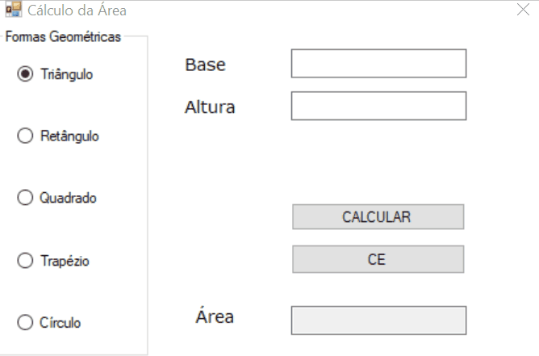

# 📦 Programação Orientada a Objetos em C#

> Repositório sobre os conceitos básicos de Programação Orientada a Objetos em C#

| [ Associação de Capacitores](src/wfaAssociacaoDeResistores.gif)  |  [ Associação de Resistores](src/wfaAssociacaoDeResistores.gif)  | 
| :---: | :---: |
| [ Cálculo de Formas Geométricas](src/wfaFormasGeometricas.gif)  |  [ Calculadora IMC](src/wfaIMC.gif)  | 
 
