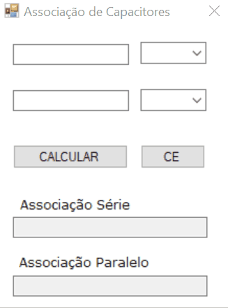

<h1 align = "center">
  Associação de Capacitores 
  
</h1>

 

  

 

    
## Descrição 📄
  

 Por meio da interface, o usuário pode inserir os valores de capacitância de dois capacitores, sendo que o usuário pode escolher a ordem de grandeza do valor informado (Farad(F), milifarad(mF), microfarad (µF), nanofarad (nF) ou picofarad(pF)), e obter o valor da capacitância equivalente da associação série e paralelo entre os capacitores. 

##
