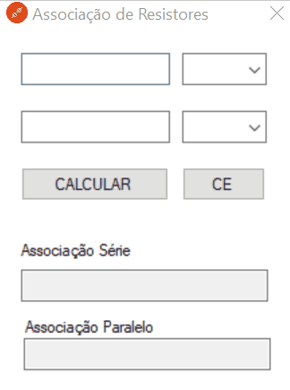

<h1 align = "center">
  Associação de Resistores 
  
</h1>

 

  

 

    
## Descrição 📄
  

 Por meio da interface, o usuário pode inserir os valores de resitência de dois reistores, sendo que o usuário tem a opção de escolher a ordem de grandeza do valor de resistência informado (ohms(Ω), kilohms(kΩ) ou megaohms(MΩ)), e obter o valor da resistência equivalente da associação série e paralelo entre os resistores. 

##
