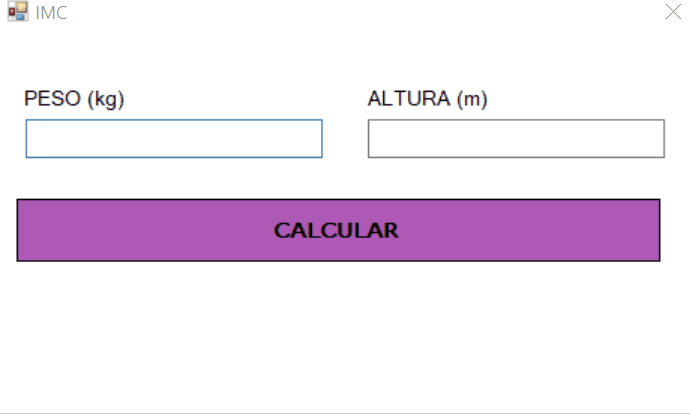

<h1 align = "center">
  Cálculo do IMC
  
</h1>

 

  

 

    
## Descrição 📄
  

 O IMC é adotado pela Organização Mundial de Saúde para o cálculo do peso ideal de cada indivíduo. 

  
 
  

 Por meio da interface, o usuário pode inserir o seu peso (em kg) e sua altura (em metros) e, com apenas um clique, visualizar o seu IMC (Índice de Massa Corpórea) e a classificação deste conforme a <a href="https://abeso.org.br/" target="_blank" rel="noopener">Associação Brasileira para o Estudo da Obesidade e da Síndrome Metabólica</a>.
 

